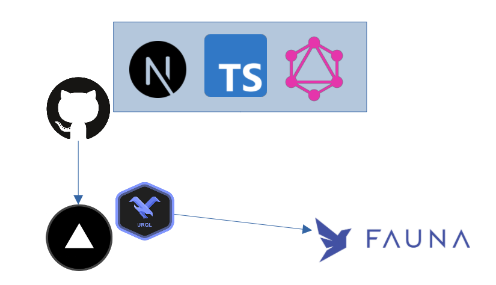

# Getting Start

## version

```sh
PS D:\workspace\fin-frontend\next-graphql> yarn -v
1.22.17
PS D:\workspace\fin-frontend\next-graphql> npm -v
8.2.0
PS D:\workspace\fin-frontend\next-graphql> node -v
v16.13.1
PS D:\workspace\fin-frontend\next-graphql> yarn next -v
yarn run v1.22.17
$ D:\workspace\fin-frontend\next-graphql\node_modules\.bin\next -v
Next.js v12.0.8
```

## start

```bash
$ yarn install
$ yarn dev
```

→→ [localhost:3000/dataEntry](http://localhost:3000/dataEntry)

# Architecture



- Next.js, TypeScript
  - Front application.
- Vercel
  - Deployment for the Next application.
- urql
  - GraphQL client for TypeScript.
- Fauna
  - GraphQL Resolver and Database

# Reference

- [urql](https://github.com/FormidableLabs/urql)
- [Fauna - Doc](https://docs.fauna.com/fauna/current/)
